# reactive_autonomous_nav

Custom reactive autonomous navigation stack for TurtleBot4, built on ROS2 Jazzy. Implements a modular planner/controller architecture with pluggable global planners and local controllers — all from scratch, no Nav2 BT server.

---

## Architecture

```
                  ┌──────────────────────┐
                  │   Global Planner     │  /goal_pose → /plan
                  │  (A* / Theta* /      │
                  │   SMAC / RRT /       │
                  │   RRT-SMAC Hybrid)   │
                  └──────────┬───────────┘
                             │ /plan
                  ┌──────────▼───────────┐
                  │   Local Controller   │  /plan + /odom → /cmd_vel_unstamped
                  │  (DWA / Pure Pursuit │
                  │   Stanley / TEB /    │
                  │   MPPI)              │
                  └──────────────────────┘
                             │
                  ┌──────────▼───────────┐
                  │  nav2_costmap_2d     │  local + global costmaps
                  │  (lifecycle managed) │
                  └──────────────────────┘
```

**Global Planners** compute a collision-free path from robot pose to goal:

| Planner | Algorithm | Status |
|---|---|---|
| `astar` | A* with octile heuristic | Working — Laplacian smoothing, RViz heat-map |
| `smac` | SMAC Hybrid A* | Working — kinematically feasible, SE2 lattice |
| `theta_star` | Theta* (any-angle A*) | Working — any-angle, exact grid-traversal line of sight |
| `rrt` | RRT | Working — shortcut smoothing, collision-checked goal link |
| `rrt_smac_hybrid` | RRT + SMAC hybrid | Working — kinematic arcs, needs corridors wider than its 0.22 m turning radius |

**Local Controllers** track the global plan reactively:

| Controller | Algorithm | Status |
|---|---|---|
| `dwa` | Dynamic Window Approach | Working — vectorized rollout, HSV trajectory viz |
| `pure_pursuit` | Pure Pursuit | Working — monotonic lookahead, curvature-limited speed |
| `stanley` | Stanley | Working — monotonic reference point |
| `teb` | Timed Elastic Band | Working — sliding band window |
| `mppi` | MPPI | Working — 1000 samples, 2.8 s horizon re-split by the measured tick interval |

---

## In simulation

Every planner and every controller above, driving a TurtleBot 4 through
`turtlebot4_gz_bringup`'s warehouse world on ROS 2 Jazzy and Gazebo Harmonic.
One run each, same start and same goal: out of the open floor at the world
origin, around the barrier at y = -1.8, and down the aisle between the racks to
(2.0, -3.2). Orange is the global plan and white is the robot's footprint;
green, the line it actually drove, appears only in the DWA clips, because
dwa_controller is the only one of the five that publishes /driven_path.

Rendering is software, so the world runs far slower than real time. Each clip
is played back at the factor measured from the simulator's own clock across
that capture, so the robot moves at the speed it actually moves.

### Global planners, DWA driving

| A* | Theta* |
|---|---|
|  | 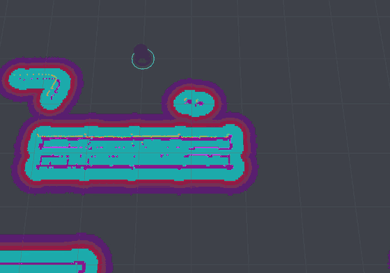 |

| SMAC | RRT |
|---|---|
| 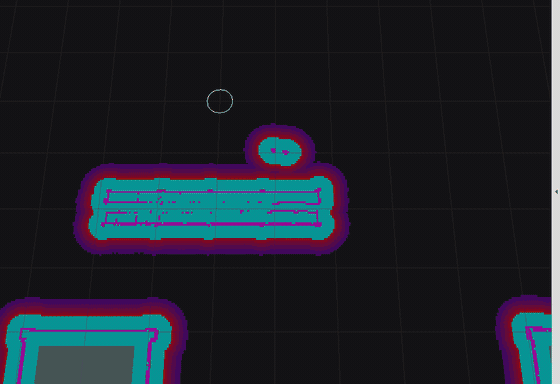 | 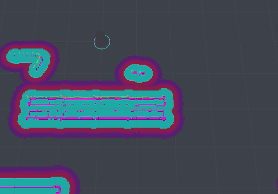 |

| RRT-SMAC hybrid | |
|---|---|
|  | |

### Local controllers, A* planning

| DWA | Pure Pursuit |
|---|---|
| 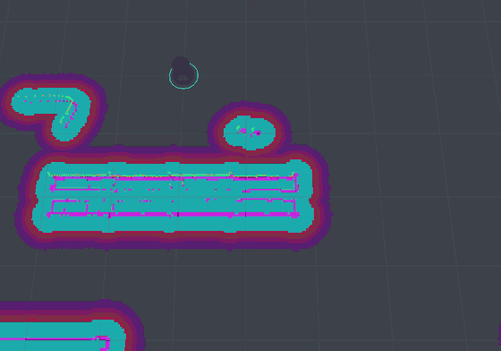 |  |

| Stanley | TEB |
|---|---|
| 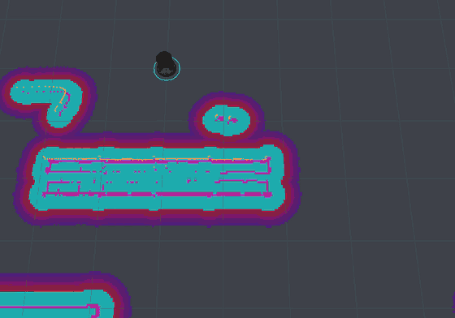 | 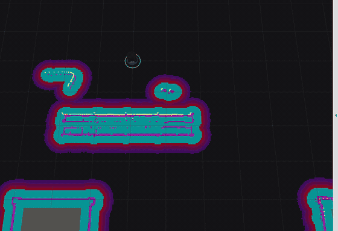 |

| MPPI | |
|---|---|
| 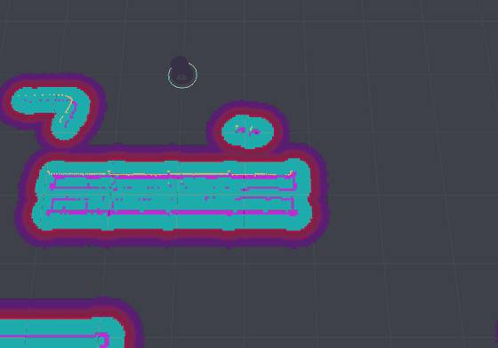 | |

### Five controllers, one path

Five TurtleBot 4s on a start line, a different local controller in each lane,
and one chicane translated across all five so the lane is not the variable.
On a gated course the planners are not launched at all: `race_timer.py`
publishes the same path, translated per lane, to all five controllers in the
same instant, so what is compared is tracking rather than each planner's luck
with the walls.

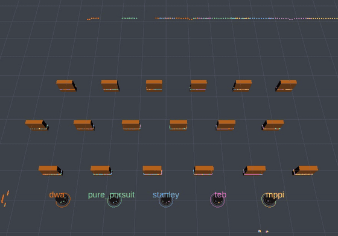

| lane | controller | finished |
| --- | --- | --- |
| r1 | dwa | 14.0 s |
| r4 | teb | 16.7 s |
| r2 | pure_pursuit | 18.9 s |
| r3 | stanley | 21.2 s |
| r5 | mppi | 24.8 s |

The first four reproduce across five races to a tenth of a second. The order is
the straight course's order but the gaps are not: first to fourth spans 7.2 s
here against 4.1 s on the straight, and stanley, which tracks the path most
tightly of the five, pays the most for it. Both courses, both other fields, and
what each one cost to get running are in [`sim/README.md`](sim/README.md).

`astar` with `dwa` is the same configuration in both halves, so it is recorded
once and shown twice rather than run twice — two runs of one pair would differ
only by simulator noise, and putting them side by side would invite reading
that noise as a result.

Localisation is the simulator's ground truth rather than a particle filter, and
the Create 3 reflex layer is bypassed: it latches a false cliff in this world
and replaces every command with a backward escape. Neither is a shortcut around
the planners — both are described, with the measurements behind them, in
[`sim/README.md`](sim/README.md), along with the harness and the rest of what
had to be true before the robot would move at all. Running the stack in
simulation is also what turned up the two bugs fixed in `fix(costmap)` and
`fix(theta_star)`, neither of which the offline benchmarks could see.

---

## How it compares

Everything below is reproducible from `bench/` — `bash bench/run.sh` regenerates
every number on this page. Taken on an Intel Xeon @ 2.10 GHz, g++ 13.3 `-O2`,
Python 3.11 with numpy 2.4, except the two figures, which are python3.12 with
numpy 1.26.4 because matplotlib here is built for 3.12.

### Local controller vs other DWA implementations

Seven implementations, same dynamic window, same sampling resolution, same
25-step horizon. Baselines are fetched, not vendored: `bench/fetch_baselines.sh`
for the C and C++ ones, and `bench/dwa_compare.py` pulls the Python ones at run
time. Only their plotting is stripped; the planner functions are theirs.

Given one window and one resolution the four C and C++ loops still evaluate
different numbers of trajectories, because they disagree about their own
bounds — this repo's lattice includes both, CppRobotics accumulates while
`v <= dw[1]`, goktug97 truncates an integer division, amslabtech walks
`side × side`. So the honest column is per trajectory, and `dwa_compare_cpp`
prints every count above its table.

**C and C++** — `bench/dwa_compare_cpp.cpp`, medians of four runs

| side | Trajectories (this repo / Cpp / goktug / ams) | This repo | [CppRobotics](https://github.com/onlytailei/CppRobotics) | [goktug97](https://github.com/goktug97/DynamicWindowApproach) (C) | [amslabtech](https://github.com/amslabtech/dwa_planner) |
| ---: | :--- | ---: | ---: | ---: | ---: |
| 6 | 42 / 36 / 25 / 36 | 0.643 µs | **0.417 µs** | 4.000 µs | 10.472 µs |
| 10 | 110 / 90 / 81 / 100 | 0.645 µs | **0.422 µs** | 4.074 µs | 9.820 µs |
| 20 | 420 / 400 / 361 / 400 | 0.660 µs | **0.417 µs** | 4.072 µs | 10.293 µs |
| 30 | 930 / 870 / 841 / 900 | 0.666 µs | **0.416 µs** | 4.050 µs | 9.777 µs |
| 50 | 2,550 / 2,450 / 2,401 / 2,500 | 0.672 µs | **0.418 µs** | 4.037 µs | 9.725 µs |

Per trajectory, and every column is flat across a 61× range in count — 1.5% for
CppRobotics, 1.9% for goktug97, 4.6% for this repo, 7.7% for amslabtech — which
is the check that these are per-trajectory costs and not per-call overhead
divided by a number.

**This repo loses to CppRobotics at every count, by 1.6× per trajectory.** An
earlier version of this table claimed the opposite, and it was wrong because
`mine_sweep` in the bench was still scoring the form
`cpp/src/dwa_controller.cpp` *replaced* — `heading_gain * (pi - yaw_err)` plus a
raw clearance margin read at the last rollout sample, the pair of mistakes that
had that controller crawling at 0.10 to 0.14 m/s against a 0.46 m/s limit. The
current scoring accumulates a normalised inflation penalty per step and
truncates at the waypoint, which is more arithmetic per trajectory, not less.
The bench had drifted from the controller it claims to measure, for the second
time in this repo.

**Python** — `bench/dwa_compare.py`, medians of four runs, per call

| Trajectories | This repo | [PythonRobotics](https://github.com/AtsushiSakai/PythonRobotics) | [kmilo7204](https://github.com/kmilo7204/dwa_planner) |
| ---: | ---: | ---: | ---: |
| 36 | **0.29 ms** | 2.66 ms | 4.14 ms |
| 100 | **0.35 ms** | 8.55 ms | 11.64 ms |
| 400 | **0.73 ms** | 39.07 ms | 47.06 ms |
| 900 | **1.79 ms** | 90.36 ms | 105.87 ms |
| 2,500 | **4.32 ms** | 260.08 ms | 296.76 ms |

Per-cell spread across the four runs: 5.4% median, 11% worst.

The structure behind the gaps is that every baseline here keeps an explicit
obstacle list and measures each rollout point against every obstacle, while this
repo reads one costmap cell. amslabtech does that per point in C++ with no
vectorisation, which is the 14.5-16.3× per trajectory. goktug97 walks a point
cloud per sample, which is the 6.0-6.3×. PythonRobotics vectorises the
comparison over numpy and kmilo7204 does not, which is why they sit where they
do relative to each other. It shows up directly as flat scaling in clutter
(Python side, 400 trajectories):

| Obstacles | This repo | PythonRobotics | kmilo7204 |
| ---: | ---: | ---: | ---: |
| 20 | 0.74 ms | 35.23 ms | 42.62 ms |
| 100 | 0.74 ms | 41.97 ms | 50.59 ms |
| 500 | 0.74 ms | 79.22 ms | 94.16 ms |
| 2,000 | 0.74 ms | **334.02 ms** | **439.39 ms** |

Flat versus linear, across a hundredfold change in obstacle count against a
4.9% median spread on the same cells. A costmap has to be built and maintained
by something else first, so this is a trade rather than a free win.

### What each of them does, not just how long it takes

A timing table cannot tell a fast implementation from a fast one that drives
badly. `python3.12 bench/gif_compare.py` and `--cpp` drive all seven in closed
loop across one field and draw it.

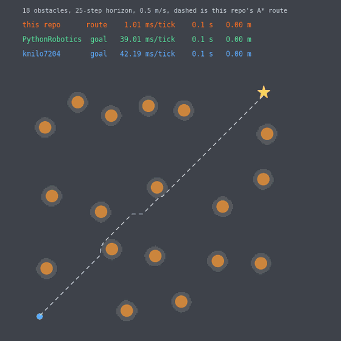

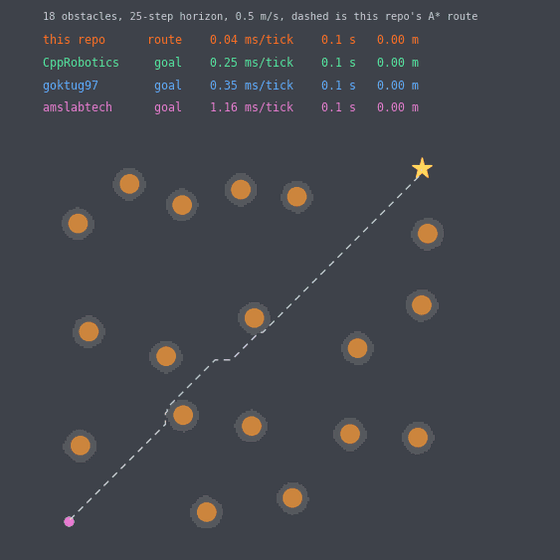

Held equal: the field, the plant and its accelerations, the resolutions, the
horizon, and the clearance — 0.425 m, measured off this repo's own costmap
rather than the 0.470 m it was asked for, because the raster and the inscribed
band together leave the nearest free cell 45 mm closer than the analytic radius
and handing the baselines the analytic one let this repo drive nearer every
obstacle than they were allowed to.

What is not equal is the input, and the label in each figure says so: this
repo's controller tracks a path and gets one from this repo's own A*, while the
six baselines are goal seekers and get the goal, because that is what each is
written for. Half of this repo is a global planner, and the distance column is
where a planner and a controller together show against a controller alone — 13.3 m
driven on a 13.83 m route, against 18.7 to 19.2 m for the two Python baselines
that arrive.

The two implementations of this repo's own controller finish within 0.2 s and
2 cm of each other, which is the cross-check that matters most: the C++ port is
the same controller. In these two runs it scores its window in 0.14 ms a tick
against 0.59 for the Python one, on the 246 trajectories the acceleration limit
leaves at this speed; the bench's own figure, on a fixed 410-trajectory window,
is in **C++ Implementations** below. Two of the four C and C++ baselines cross about 3 m and
then crawl, and `bench/README.md` has the instrumented reason — an unnormalised
`1 / min_r` clearance term that outweighs their whole speed term at about a
metre from an obstacle, which is the pathology this repo's own C++ controller
was fixed for.

### Global planner vs Nav2

Reference numbers are Table I of Macenski et al., [*Cost-Aware Kinematically
Feasible Planning for Mobile and Surface Robotics*](https://arxiv.org/abs/2401.13078),
which benchmarks the Nav2 Smac Planners against NavFn and SBPL ARA* on
10,000 m² random occupancy maps at 5 cm resolution with 1,000 start-goal pairs.
`bench/nav2_maps.py` rebuilds that map and query geometry (2000 × 2000 cells,
100 × 100 m, ~50 m paths) so the timings measure comparable work.

| Obstacle density | This repo, C++ A\* | Nav2 Smac 2D-A\* | Nav2 NavFn | Nav2 Hybrid-A\* |
| ---: | ---: | ---: | ---: | ---: |
| 10% | **4.6 ms** | 66.2 ms | 71.1 ms | 39.1 ms |
| 15% | **6.1 ms** | 85.6 ms | 66.5 ms | 40.7 ms |
| 20% | **14.8 ms** | 88.8 ms | 61.0 ms | 38.8 ms |

**Read that with the caveats.** Their CPU (Ryzen 5 5600X) is considerably faster
than the one these numbers came off, which flatters this repo. Against that,
Nav2's Smac 2D-A\* is cost-aware and returns a smoothed path, and NavFn solves a
full navigation function — both do more work per call than a plain octile A\*.
The honest claim is that this planner is in the same order of magnitude on
equivalent maps, not that it beats Nav2.

`python3 bench/nav2_compare.py`

### Against nav2's controllers, in a live graph

`nav2_dwb_controller` and the other nav2 local controllers cannot go in the
tables above: they need a live ROS 2 graph and costmap plugins to run at all, so
any number taken outside one would be measuring the harness. They are raced
instead, on the same robot, the same costmap settings and the same path — see
**The nav2 field** and **The versus field** in [`sim/README.md`](sim/README.md).

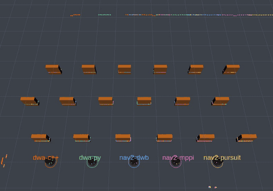

| lane | controller | finished |
| --- | --- | --- |
| r1 | dwa-c++ (this repo) | 13.9 s, 5.98 m |
| r2 | dwa-py (this repo) | 13.9 s, 6.05 m |
| r5 | nav2 `RegulatedPurePursuitController` | 14.5 s, 5.88 m |
| r3 | nav2 `DWBLocalPlanner` | did not cross: 5.79 m of 5.80 |
| r4 | nav2 `MPPIController` | did not cross: 2.35 m of 5.80 |

Read the second column before the first: DWB drove the whole course and is not
credited with a finish because it stopped 10 mm short of a line the timer
measures by crossing.


## Dependencies

- ROS2 Jazzy
- `nav2_costmap_2d`, `nav2_lifecycle_manager`
- `slam_toolbox`
- `tf2_ros`, `rclpy`, `nav_msgs`, `geometry_msgs`, `visualization_msgs`

Install nav2:
```bash
sudo apt install ros-jazzy-navigation2 ros-jazzy-nav2-bringup ros-jazzy-slam-toolbox
```

---

## Build

```bash
cd ~/ros2_ws
colcon build --packages-select reactive_autonomous_nav
source install/setup.bash
```

---

## Usage

```bash
# Default: A* planner + DWA controller, real robot
ros2 launch reactive_autonomous_nav nav_launch.py

# Simulation (Gazebo / Isaac Sim)
ros2 launch reactive_autonomous_nav nav_launch.py use_sim_time:=true

# Pick any planner + controller combo
ros2 launch reactive_autonomous_nav nav_launch.py \
  use_sim_time:=true \
  planner:=theta_star \
  controller:=mppi

# Available planner values: astar, theta_star, smac, rrt, rrt_smac_hybrid
# Available controller values: dwa, pure_pursuit, stanley, teb, mppi
```

Send a goal from CLI:
```bash
ros2 topic pub --once /goal_pose geometry_msgs/msg/PoseStamped \
  '{header: {frame_id: "map"}, pose: {position: {x: 2.0, y: 1.0, z: 0.0}, orientation: {w: 1.0}}}'
```

Visualize in RViz:
```bash
rviz2 -d $(ros2 pkg prefix reactive_autonomous_nav)/share/reactive_autonomous_nav/config/nav_view.rviz
```

---

## Package Structure

```
reactive_autonomous_nav/
├── reactive_autonomous_nav/
│   ├── astar_planner.py          # A* global planner
│   ├── theta_star_planner.py     # Theta* any-angle planner
│   ├── smac_planner.py           # SMAC hybrid A* planner
│   ├── rrt_planner.py            # RRT sampling planner
│   ├── rrt_smac_hybrid_planner.py# RRT-SMAC hybrid planner
│   ├── dwa_controller.py         # DWA local controller
│   ├── pure_pursuit_controller.py# Pure Pursuit controller
│   ├── stanley_controller.py     # Stanley controller
│   ├── teb_controller.py         # TEB controller
│   ├── mppi_controller.py        # MPPI controller
│   └── costmap_manager.py        # Lifecycle costmap activator
├── launch/
│   └── nav_launch.py             # Pluggable launch file
├── config/
│   ├── costmap_params.yaml       # Local + global costmap config
│   ├── slam_params.yaml          # SLAM Toolbox config
│   └── nav_view.rviz             # RViz preset
└── package.xml
```

---

## Performance Notes

Things that can meaningfully speed this up:

- **A\* / Theta\***: Pre-inflating the costmap offline, so the planner sees binary free/occupied rather than re-reading cost per expansion, is the obvious next thing to try. Untested here, so it carries no figure. Also try lowering `PATH_BLOCKED_LOOKAHEAD` if your env is mostly static.
- **DWA**: The bottleneck is trajectory rollout count. Decrease `vel_res` + `yawrate_res` or shrink `predict_time` to reduce samples. Alternatively, move rollout to numpy fully (already partially done) and profile with `cProfile`.
- **MPPI**: Bump sample count only if you have a GPU or vectorized backend. On CPU, keep samples ≤ 512.
- **Costmap**: `update_frequency: 20.0` is high for CPU-only — drop to 10 Hz on real hardware if `/cmd_vel` latency spikes.
- **General**: Run planners and controllers in separate processes (already the case via launch file). Pin them to isolated CPU cores with `chrt` if latency is critical.

---

## Robot

Built and tested on **TurtleBot4** (iRobot Create 3 base + RPlidar A1).

Compatible with the custom **mobile manipulator** simulation (4-wheel differential drive + Hokuyo LiDAR + UR12 arm) running in Gazebo / Isaac Sim.

---

## C++ Implementations

The `cpp/` directory contains a separate ROS2 C++ package (`reactive_nav_cpp`) with native C++ ports of the three working components:

| Component | File |
|---|---|
| A* global planner | `cpp/src/astar_planner.cpp` |
| SMAC hybrid A* planner | `cpp/src/smac_planner.cpp` |
| DWA local controller | `cpp/src/dwa_controller.cpp` |

Build and run the C++ package:
```bash
# from your ros2_ws root — both packages build together
colcon build --packages-select reactive_nav_cpp
source install/setup.bash

# run C++ A* planner directly
ros2 run reactive_nav_cpp astar_planner

# or C++ DWA controller
ros2 run reactive_nav_cpp dwa_controller
```

The C++ DWA is 7× lower latency than the Python one on the same
410-trajectory acceleration-limited window — 0.139 ms against 0.961 ms — and
4× on the full 2,626-trajectory velocity space, the gap narrowing with batch
size because numpy's fixed per-call overhead amortises away. The C++ A\* is
105-196× on the shared maps, of which roughly 3× is algorithmic rather than
language: the port also added a closed set, so it expands 21,015 nodes where
Python expands 61,631 on the same map. `bench/run.sh` prints both tables.

On the same course in Gazebo the two DWA implementations finish within 0.2 s of
each other, because a 6 m course at 0.46 m/s is nowhere near either one's
budget — see **The versus field** above. The per-tick margin is what buys
headroom on a robot with a 20 ms loop, not a faster lap.

---

## License

MIT — Mohammed Abdul Rahman, Northeastern University Seattle
